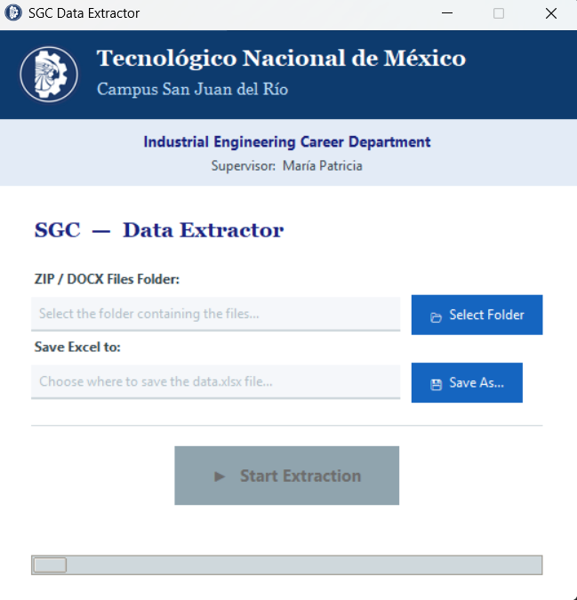

# SGI Data Extractor

A professional graphical interface and processing engine designed to extract academic metrics from **SGI "Course Management Tracking"** documents.

This tool automates the collection of data from `.docx` files (individual or inside `.zip` archives) and consolidates them into a formatted **Excel** report. It is specifically tailored for the institutional formats of **Tecnológico Nacional de México (TecNM)**.

> **Core Concepts**: Multithreading, Regular Expressions (Regex), COM Automation (Word), ZIP processing, and GUI development (Tkinter).

---

## 📸 Interface

<p align="center">
  
</p>

---

## ✨ Features

- **Automated Extraction**: Scans paragraphs and tables to extract Teacher names, Subjects, Enrolled Students, and Unit performance metrics.
- **Responsive Multithreading**: Uses a dedicated background thread for extraction, ensuring the GUI never freezes during heavy processing.
- **Legacy Support (.doc)**: Automatically converts old legacy Word files to `.docx` using Word COM automation.
- **Recursive Scanning**: Deep searches through folders and looks inside `.zip` archives without requiring manual extraction.
- **Smart Filtering**: Employs complex Regex patterns to distinguish between actual data and template placeholder text (e.g., ignoring "(1)", "(2)").
- **Professional Export**: Generates an Excel file with frozen panes, institutional color palettes (Blue/White), and auto-adjusting column widths.

---

## 🧩 Architecture

### Multithreading Architecture
The application uses a **Producer-Consumer** pattern to ensure the interface remains fluid and responsive during intensive file operations:

- **Main Thread (UI Thread)**: 
  - Manages the Tkinter event loop.
  - Handles all user interactions (button clicks, folder selection).
  - Owns the GUI resources; all visual updates happen here.

- **Worker Thread (Background Task)**: 
  - Triggered via `threading.Thread` when the user clicks "Start".
  - Executes the `extract_sgi.py` logic (I/O intensive operations).
  - Handles document parsing and Excel generation without blocking the UI.

- **Thread-Safe Communication**: 
  - Uses the `.after()` method to safely pass messages from the worker thread back to the main thread.
  - Updates the progress bar and status labels only when the background process signals a state change.
    
### Extraction Logic
1. **Header Parsing**: Extracts "Revision" from document headers and "Teacher/Subject" from the body, handling multi-line paragraph splits.
2. **Table Identification**: Validates the "Tracking Table" by checking for at least three core keywords (e.g., Units, Passed, Failed).
3. **Data Validation**: 
    - Identifies rows starting with Roman Numerals (`I, II, III...`).
    - Identifies rows starting with Digits (`1, 2, 3...`).
    - Filters out specific instructional headers.

---

## 🛠 Hardware & Requirements

- **OS**: Windows (Required for `pywin32` / Microsoft Word COM interface).
- **Software**: Microsoft Word must be installed to process legacy `.doc` files.
- **Python Dependencies**:
  ```bash
  pip install python-docx openpyxl pillow pywin32

  ## 🛠 Troubleshooting

*   **Word COM Errors**: Ensure Microsoft Word is installed and activated on your Windows machine if you need to process legacy `.doc` files.
*   **Permission Denied**: Close any Excel files or Word documents that are currently open and being targeted by the script before starting the extraction.

---

📬 **Contact**  
If you have any questions:  
📧 [badillouribeguillermoca@gmail.com](mailto:badillouribeguillermoca@gmail.com)

📄 **License**  
This repository is licensed under the MIT License.
